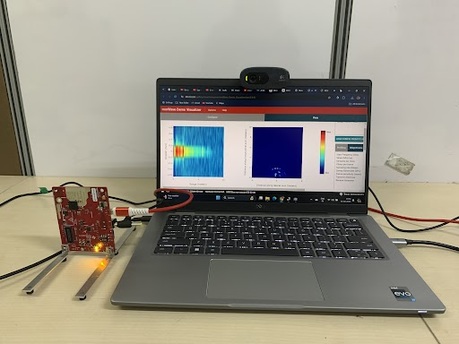

# <i>mmDoppler</i> 

<p align="center">

</p>

<hr></hr>

Human activity recognition (HAR) is essential in healthcare, elder care, security, and human-computer interaction, depending on precise sensor data to identify activities. Millimeter wave (mmWave) radar is promising for HAR due to its ability to penetrate non-metallic materials and provide high-resolution sensing. Traditional HAR methods using pointcloud data from sensors like LiDAR or mmWave effectively capture macro-scale activities but struggle with micro-scale activities. This paper introduces <i>mmDoppler</i> , a novel dataset using Commercial off-the-shelf (COTS) mmWave radar, capturing both macro and micro-scale human movements. The dataset includes seven subjects performing 19 distinct activities and employs adaptive doppler resolution to enhance activity recognition. By adjusting the radar's doppler resolution based on the activity type, our system captures subtle movements more precisely. <i>mmDoppler</i>  includes range-doppler heatmaps, offering detailed motion dynamics, with data collected in a controlled environment with single as well as multiple subjects performing activities simultaneously. This dataset bridges the gap in HAR systems, providing a valuable resource for improving the robustness and accuracy of activity recognition using mmWave radar.

| **Feature**     | **Description**                                                                                                                                            |
| :-------------: | :--------------------------------------------------------------------------------------------------------------------------------------------------------- |
| datetime        | The date and time when the data was recorded. This helps in time-series analysis and synchronization with other data sources.                        |
| rangeIdx        | Index corresponding to the range bin of the detected object. It indicates the distance of the  object from the radar.                                 |
| dopplerIdx      | Index corresponding to the Doppler bin, which represents the relative velocity of the detected object.                                               |
| numDetectedObj  | The number of objects detected in a single frame. This feature is useful for understanding  the multi-user activity dynamics of the scene.            |
| range           | The actual distance measurement of the detected object from the radar in meters.                                                                           |
| peakVal         | The peak value of the detected signal, indicating the strength of the returned radar signal.                                                               |
| x\_coord        | The x-coordinate of the detected object in the radar's coordinate system.                                                                                  |
| y\_coord        | The y-coordinate of the detected object in the radar's coordinate system.                                                                                  |
| doppz           | The Range-doppler Heatmap value indicating the radial velocity of the detected object, helping to distinguish between stationary and moving objects. |
| Position        | The position of the subject with respect to the radar. It can have values like 2m, 3m and 5m.                                                              |
| Orientation     | The orientation of the subject relative to the radar's bore-sight angle: left, right, front, and back.                                                     |
| activity        | The specific activity being performed by the subject, such as walking, running, or typing, used for machine learning and classification tasks.       |
| activity\_class | A broad categorical label of the type of activity: whether macro activity  or micro activity                                                               |

## Installation:

To install use the following commands.
```bash
git clone --recurse-submodules https://github.com/arghasen10/mmDoppler.git
pip install -r requirements.txt
```
## Data Collection Setup

To install mmWave Demo Visualizer from Texas Instruments, first go to this [link](https://dev.ti.com/gallery/view/mmwave/mmWave_Demo_Visualizer/) and select SDK [2.1.0](https://dev.ti.com/gallery/view/mmwave/mmWave_Demo_Visualizer/ver/2.1.0/). Now go to Help and select Download or Clone Visualizer. Finally you need to download and install the entire repository in your machine.

Now copy all the content of the provided submodule `mmWave-Demo-Visualizer` and paste it in the installaed mmWave-demo-visualizer directory i.e. **C:\Users\UserName\guicomposer\runtime\gcruntime.v11\mmWave_Demo_Visualizer**

Once you are done with the installation run 
```bash
launcher.exe
```
Finally using this tool you can save mmWave data in your local machine. Data will be saved in a txt file in JSON format.

## Process Collected datasets

To process the collected raw datsets in `.txt` format, first keep all the files inside `datasets/raw_datasets` directory. Also keep the provided script `process_data.py` in the same directory `datasets/raw_datasets`. It will process the dataset and will store it in `.pkl` format as pandas dataframe. Note, you need to change the usernames as provided in the `process_data.py` as per your requirements.


## Directory Structure


```
.
├── ./datasets
│   ├── ./datasets/process_data.py
│   ├── ./datasets/processed_datasets
│   │   ├── ./datasets/processed_datasets/macro_df.pkl
│   │   ├── ./datasets/processed_datasets/macro_df_subset.pkl
│   │   ├── ./datasets/processed_datasets/micro_df.pkl
│   │   └── ./datasets/processed_datasets/micro_df_subset.pkl
│   └── ./datasets/README.md
├── ./LICENSE
├── ./models
│   ├── ./models/macro_classifier.py
│   ├── ./models/micro_classifier.py
│   ├── ./models/radhar_macro.py
│   └── ./models/radhar_micro.py
├── ./pictures
│   └── ./pictures/hardwaresetup.jpg
├── ./README.md
└── ./supplementary_plots
    ├── ./supplementary_plots/dataset_pie.py
    ├── ./supplementary_plots/plot_macro_tsne.py
    ├── ./supplementary_plots/plot_micro_tsne.py
    ├── ./supplementary_plots/pointcloud.py
    └── ./supplementary_plots/resuts.py

5 directories, 18 files
```

## Description 

We have provided our dataset in the **datasets** directory. 

To run the activity classifier check **models** directory.

In **mmwave_demo_visualizer** directory we have provided the instructions to run the demo visualizer for data collection as well as real time data visualization. This implementation is made by Texas Instruments and we have slightly modified the version to enable data collection and data annotations.

In **suppllementary_plots** directory we have provided the source code for the plots we added in the paper. 

<hr>

## Dataset Importance

| Datasets  | Modality                                                 | Activity Type              | \# Classes | Granularity     | \# Frames | Effective Duration (s) | Multi-Subjects |
| --------- | -------------------------------------------------------- | -------------------------- | ---------- | --------------- | --------- | ---------------------- | -------------- |
| mRI       | mmWave pointcloud, RGB, Depth Camera and IMU signals     | Pose estimation            | 12         | Macro           | 160k      | 5333                   | No             |
| mm-FI     | RGB, Depth Camera, LiDAR and mmWave pointcloud, WiFi CSI | Daily activities           | 27         | Macro           | 320k      | 10666                  | No             |
| MiliPoint | mmWave pointcloud                                        | Daily activities           | 49         | Macro           | 545k      | 18166                  | No             |
| RadHAR    | mmWave pointcloud                                        | Exercise                   | 5          | Macro           | 167k      | 5566                   | No             |
| <b><i>mmDoppler</i></b> | <b>mmWave pointcloud, Range-Doppler heatmaps</b>                | <b>Daily activities, Exercise</b> | <b>19</b>         | <b>Macro and Micro</b> | <b>75k</b>       | <b>23100</b>                  | <b>Yes</b>            |

## Reference
To refer <i>mmDoppler</i> dataset, please cite the following work.

BibTex Reference:
```
Coming Soon ....
```
For questions and general feedback, contact Argha Sen (arghasen10@gmail.com).

